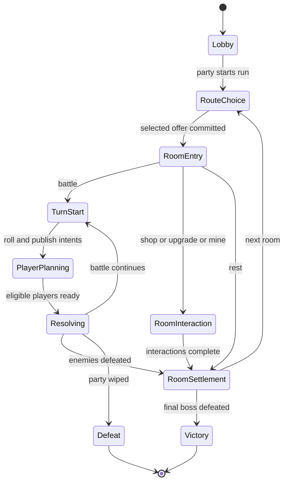

# RogueDice: Godot and Steam rebuild specification

Source review: September 8, 2026. Scope: gameplay, content, progression, simulation, desktop interaction, and cooperative networking. Exact artwork, animation, and screen layout are deliberately unspecified.

This document describes a new implementation, not a conversion of the React components. The distinctive game is a cooperative dice-and-gem roguelike: each hero rolls a personal hand, selectively rerolls it, and automatically activates every eligible skill using that same hand. Building a compatible collection of dice and skill gems is the central strategic activity.

The repository is a prototype. Executable definitions and call sites are the primary evidence for existing gameplay. The source contains three heroes, eleven skills, two enemies, seven room choices, and an incomplete run loop. It does not contain a finished campaign or a reliable multiplayer simulation.

**Reading conventions:** “Existing” describes source behavior; “Intent” describes comments, descriptions, or unfinished structures; “Proposed” specifies a deliberate change for the Godot version. Where executable code and descriptions disagree, both are recorded. Sections 2–8 document the original; sections 9–14 define the recommended rebuild. Proposed balance values are initial playtest settings, not validated balance.

The [expanded content catalog](CONTENT_CATALOG.md) develops the proposed game further: hero traits, eight additional gems, eight relics, six die variants, enemy roles, boss encounters, and a longer campaign. This document defines the common rules; the catalog supplies content and explicitly named run profiles. Neither changes the historical source description in sections 2–8.

This was a static source review supplemented by exact enumeration of starting dice outcomes and inspection of upstream networking documentation. The web app was not run. Local dependencies are absent, and the existing test file imports a nonexistent `src/tests/helpers` module. Findings about broken execution paths should therefore be read as source findings, not reports from a played session.

## 1. Product definition and what to preserve

Build a desktop game for **one to four cooperating players**, with offline solo play and Steam-hosted online sessions. Each player controls one hero. Duplicate hero selections are allowed by the existing lobby and should remain allowed initially.

Preserve these design pillars:

1. **One hand powers several skills.** Dice are not assigned to individual skills, spent, or removed when a skill activates. A pair can enable Block while one of the same dice also contributes to Strike.
2. **Selective rerolling is the main combat decision.** Keeping a low pair may be better than chasing the highest total. Acquired gems change what counts as a good hand.
3. **Dice composition matters.** Smaller dice improve repeated-value combinations; larger dice enable high-roll thresholds and totals. Replacing a D4 with a D20 is a strategic trade, not an unconditional upgrade.
4. **Gems have four C's.** Color, Carat, Cut, and Clarity affect a skill differently, and only three of them are rolled. A low-rarity skill with favorable properties can be useful throughout a run. See section 9.2 for the authoritative model.
5. **Runs alternate combat with build decisions.** Shops, healing, dice modification, gem improvement, and mining should compete for limited room visits and currency.
6. **Players plan together and resolve in a legible sequence.** Show why skills activate and what they do. The cooperative experience should support discussion without requiring fast reactions.

There is no evidence of PvP, grid movement, positional combat, mana, manually selected attacks, experience levels, or persistent stat upgrades. Do not add those merely because they are common in roguelikes.

## 2. Existing run and lobby loop

### 2.1 Lobby

The web menu creates a six-character uppercase base-36 lobby code or joins an existing code. Firebase identifies users. Lobby membership stores a name, hero index, ready flag, host flag, and join timestamp.

- Maximum party size is four; a solo player can start.
- Players choose a hero and toggle ready.
- When everyone is ready, a multiplayer lobby starts after five seconds; solo starts immediately.
- If only the host is ready, a sixty-second countdown can start the game with unready players.
- The lobby includes kicking and host transfer.
- A user's `activeGameId` routes them back to the saved Firestore game document. This is a basic re-entry path, not a complete reconnection protocol.

The game treats `players[0]` as its host. However, the lobby's supposedly host-first comparator actually puts non-hosts first. Leaving logic can also mark a replacement host when the departing player was not the host. Use explicit host identity in the rebuild.

Sources: [Lobby](../src/components/Lobby.tsx), [menu](../src/app/(game)/game/menu/page.tsx), [Game](../src/components/Game.tsx).

### 2.2 Start of a run

Each player starts with their hero's maximum HP, dice, and two gems, plus:

| Property | Initial value |
|---|---:|
| Current HP | Maximum HP |
| Block | 0 |
| Gold | 0 |
| Relics | Empty array |
| Current roll | Empty array |
| Maximum rerolls per combat turn | 1 |
| Available rerolls | 1 |

The run's room counter starts at zero. The initial room offer contains only normal Battle. Subsequent room offers attempt to contain three different room definitions. The host selects the room for the whole party; there is no vote.

Existing room selection uses the room counter as “luck.” The exclusion mechanism is imperfect, so three unique choices are intended but not guaranteed.

### 2.3 Progress and termination

Winning a nonfinal battle clears rolls and block, resets readiness and rerolls, awards gold to **each player**, and advances the room counter. HP carries between rooms. Shop, Workshop, and Lapidary attempt to advance when all players mark themselves done. Rest heals immediately and advances without entering a dedicated scene.

All heroes at zero HP means defeat. Victory is temporary scaffolding: after winning a battle, the code ends the run when `round + 1 > 3` and assigns the first player's UID as “winner.” Thus, a battle at zero-based room index 3 ends the run; this is not simply “win three battles.” Noncombat rooms also advance the counter, and only battle completion checks this victory condition. There is no boss implementation.

The terminal battle branch does not apply the usual room-reward write. Buff/debuff cleanup is also not explicitly defined between rooms.

Sources: [initialization and run transitions](../src/game/ServerFunctions.ts), [room generation](../src/game/constants/Rooms.ts).

## 3. Heroes and dice

### 3.1 Starting heroes

All starting gems have Cut 1 (Poor) and Clarity 1 (Fractured), so every starting hero is separated only by Carat and by which Colors they open with. Carat differences are shown below.

| Hero | HP | Five starting dice | Starting gems | Mechanical identity in the source |
|---|---:|---|---|---|
| Ardor | 100 | D6, D6, D6, D8, D8 | Strike C1; Block C2 | Highest health; stronger starting Block; moderate rolls |
| Kait | 70 | D4, D4, D4, D4, D20 | Strike C2; Block C1 | Frequent small matching sets plus one high-variance die |
| Max | 80 | D4, D6, D6, D8, D12 | Strike C1; Block C1 | Broad range of faces and intermediate health |

The warrior/rogue/mage descriptions are flavor. There are no implemented class passives or class restrictions on gems. Max does not start with magic or healing.

Source: [Characters](../src/game/constants/Characters.ts).

### 3.2 Dice model

Defined shapes are D4, D6, D8, D10, D12, and D20. Defaults have faces numbered 1 through the die's side count. `DEFAULT_DECK` contains one of each shape, but actual heroes use their own five-die decks.

A die stores a shape and a list of faces; a face stores a numeric value and optional color. A roll picks a **face index uniformly** and copies its fields into the roll result. Consequently, repeated values on different faces would increase the probability of that value. Face color has no gameplay effect. Enchantments are only mentioned in a comment.

Every die in a hero's deck is rolled each turn. There is no draw pile, discard pile, or random five-die selection from a larger bag. Although the array can technically be larger, five is the only implemented hero loadout size.

Roll results store die index, value, and a roll counter. The counter forces an animation when a rerolled die shows the same value again. Results are generated before the visual dice rotate; the existing game already uses visual dice rather than physics to decide outcomes.

Sources: [Defaults](../src/game/constants/Defaults.ts), [die schema and animation](../src/components/Battle/components/3d/Dice.tsx), [rollDice](../src/game/helpers.tsx).

### 3.3 Quantitative implications of the starting decks

The following values enumerate every equally likely initial face combination. They exclude rerolls, enemy block, additional gems, and defects in the animation path.

| Hero | Expected raw starting Strike | Probability of any pair | Probability of at least three equal values | Probability of at least one 7 |
|---|---:|---:|---:|---:|
| Ardor | 7.352 | 82.639% | 15.799% | 23.438% |
| Kait | 12.746 | 92.500% | 24.531% | 5.000% |
| Max | 8.673 | 76.852% | 13.194% | 19.792% |

The enumerations cover 13,824, 5,120, and 13,824 outcomes respectively. Kait's D20 makes her starting Strike substantially stronger on average, while her D4s also give the highest pair frequency. These are useful initial balance benchmarks; equal maximum possible totals do not imply equal strength.

Only Kait can activate base-Clarity Stun with her starting deck, with a 5% initial-roll chance of a 20. Ardor has two dice capable of rolling 7; Max has two; Kait has one. None can achieve Lucky Strike's three-seven jackpot without modifying their dice.

## 4. Existing combat contract

### 4.1 Turn structure

1. At the start of each battle turn, living heroes roll their complete decks. Their rerolls reset to `maxRerolls`, and their ready flags clear.
2. Each player selects the dice to reroll. **Selected means reroll**, while unselected dice retain their values.
3. A reroll spends one reroll opportunity regardless of how many dice were selected. With the initial maximum of one, each turn has an initial roll and at most one selective reroll.
4. A player can lock in without rerolling. Spending the final reroll schedules automatic lock-in after three seconds.
5. Once every player's lock flag is true, each living, unstunned hero evaluates every owned gem against their own final hand.
6. Enemies roll their decks at this point and evaluate their skills the same way. They do not reroll or choose among skills.
7. Actions are ordered by player array order, then each player's skill-array order, followed by enemy array order and enemy skill-array order.
8. Effects within an action resolve in order. A dead actor's queued actions are skipped by the battle scene.
9. After the action animation sequence, the code checks defeat, battle victory, or the next combat turn.

The state type declares `roll`, `action`, and `enemy`, but the active flow combines player and enemy actions into the `action` phase. No separate enemy-phase transition is implemented.

**Important:** every owned gem participates. There is no equipment capacity, per-turn mana cost, skill choice, cooldown, or die consumption. Buying a gem appends it to the skill list, so purchase order also affects execution order. No gem reorder interaction is implemented.

Sources: [ServerFunctions](../src/game/ServerFunctions.ts), [DiceDisplay](../src/components/Battle/components/DiceDisplay.tsx), [BattleScene](../src/components/Battle/BattleScene.tsx).

### 4.2 Damage, defense, healing, and death

Damage consumes block first, then reduces HP to a minimum of zero. Block accumulates across combat turns; there is no turn-start block decay. Block resets when the normal room-completion path runs.

Healing increases HP. Ordinary effects skip targets whose HP is already zero, so combat healing does not revive. Rest bypasses the effect runner, applies directly to every player, and can therefore revive a zero-HP hero.

Existing healing incorrectly caps the recipient against the **caster's** maximum HP. This is masked by the current self-healing skill set but matters for future ally heals.

In the original implementation damage and healing could be fractional, because the Clarity multiplier used quarter increments and most effects were not rounded. Shield Bash explicitly floored its block-derived damage. The rebuild floors every completed amount exactly once, inside the Carat multiplier.

### 4.3 Targeting

The schema declares `self`, `allies`, `enemy`, and `enemies`:

| Target token | Player actor | Enemy actor |
|---|---|---|
| `self` | Acting hero | Acting enemy |
| `allies` | All heroes, including caster | All enemies, including caster |
| `enemy` | **All enemies in the implementation** | One random living hero |
| `enemies` | All enemies | All heroes |

Dead recipients are filtered during effect application. Each effect independently resolves targets, so an enemy skill with several effects can choose a different random hero for each effect. The scene defines no player target-selection input.

The current rooms contain one enemy each, concealing the player's singular-target bug. For the rebuild, give single-target and group-target skills explicit, distinct semantics.

### 4.4 Stun and other statuses

Buffs and debuffs are string-to-number maps. Only stun has an implemented turn mechanic. A positive stun count causes the actor's entire skill batch to be omitted when the next action list is generated, and the counter decreases by one. Applied stun stacks additively.

Because the complete queue is generated before actions resolve, a stun applied during that queue does not cancel actions already queued. Its apparent intent is to skip future turns. Stun changes made during queue generation do not have a clean, explicit persistence write, and the presentation path has additional defects described in section 8.

Poison, strength, and other statuses are examples in comments, not working mechanics.

Source: [effect and target helpers](../src/game/helpers.tsx), [action generation](../src/game/ServerFunctions.ts).

## 5. Complete existing skill-gem catalog

### 5.1 Properties and notation

A saved gem contains `key`, `carat`, optional `cut`, and optional `clarity`. Cut and Clarity default to 1 in skill functions. Generated Carat ranges from 1–24; generated Cut and Clarity range from 1–5. Rarity belongs to the skill definition, not the gem's property rolls.

Section 5.2 records what the original implementation did, where the single multiplier `M(L)` was
attached to Clarity. **Section 9.2 supersedes it**: Carat is the multiplier, and Clarity is flat.

For the legacy formulas in this section only:

- `C` = Carat, `K` = Cut, `L` = Clarity.
- `M(x) = 1 + (x - 1) / 4`, producing 1, 1.25, 1.5, 1.75, 2 for ranks 1–5. The legacy tables below
  apply it as `M(L)`; the corrected rules apply the Carat multiplier `M(C)` instead.
- `H` = highest die value; `T` = sum of all dice.
- `High(K)` and `Low(K)` sum the highest or lowest K dice, or all available dice if K exceeds hand size.
- `p` = value shown by the highest matching pair, **not the sum of both dice**.
- Listed damage targets use the existing `enemy` token, with the targeting caveat in section 4.3.

The functions do not consistently validate out-of-range properties or empty hands. Those are input-validation requirements for the new implementation.

### 5.2 Activation and effect formulas

| Key / name | Rarity | Existing activation | Existing effects, in order |
|---|---:|---|---|
| `STRIKE` / Strike | 1 | Always | Damage `(High(K) + C) × M(L)` |
| `BLOCK` / Block | 1 | Any value appears at least twice | Gain self block `(p × K + C) × M(L)` |
| `HEAL` / Heal | 2 | Always | Heal self `Low(K) + C × M(L)`; only Carat is multiplied in the executable expression |
| `MULTISTRIKE` / Multistrike | 2 | Straight of length 5 at L1–2, length 4 at L3–4, or length 3 at L5 | K separate hits of C damage each |
| `LUCKYSTRIKE` / Lucky Strike | 3 | At least one die equals 7 | For each 7: damage `7 × M(K) × J`, then gain `C × J` gold. `J = 1` for one or two sevens; for three or more, `J = L + 1`, except L5 gives 7 |
| `HEAVYSTRIKE` / Heavy Strike | 1 | A group of at least three equal values | Damage `(v × K + C) × M(L)` using the group selected by the implementation |
| `BLESSING` / Blessing | 3 | Straight of length 3 | Gain C gold, then heal self `K × M(L)` |
| `SHIELDBASH` / Shield Bash | 2 | Code requires an exact pair **and more than one exact triple** | Gain C block, then damage `floor(current block × K)`; at L5 also apply one stun |
| `STUN` / Stun | 4 | `H ≥ 21 - L`, i.e. threshold 20, 19, 18, 17, or 16 | Damage `H + C`, then apply K stun |
| `BULLWARK` / Bullwark | 3 | `T ≤ 21 - 2L`, i.e. 19, 17, 15, 13, or 11 | Gain the block value below; self-stun for 3, 2, 2, 1, or 0 turns at K1–5 |
| `DRAINSTRIKE` / Drain Strike | 4 | `T ≥ 45 - 5L`, i.e. 40, 35, 30, 25, or 20 | Damage `H × K`, then heal self C |

Bullwark's block by Carat 1–24 is:

```text
10, 20, 30, 40, 50, 60, 70, 80, 90, 100, 110, 120,
130, 140, 150, 160, 170, 180, 190, 200, 210, 230, 250, 300
```

There are no rarity-5 skill definitions, although the generation system can roll rarity 5. Skill `cost` is an unused optional field; shop prices use a different formula.

Source for every row: [Skills](../src/game/constants/Skills.ts). Supporting pattern and scaling functions: [helpers](../src/game/helpers.tsx).

### 5.3 Pattern and description discrepancies

| Topic | What a literal port would do | Intended or recommended interpretation |
|---|---|---|
| Pair | `getPairs` takes two dice from any group of size ≥2 | Keep; triples and larger sets contain a usable pair |
| Heavy Strike group | Prefer the first exact triple; otherwise first quad; otherwise first quint. Numeric key iteration normally favors lower values within each group class | Use the highest value appearing at least three times, as the description suggests |
| Straight | Sort all dice without deduplicating; duplicates reset the streak; return the first minimum-length run found | Deduplicate values and select a deterministic qualifying run. For example, `[1,2,2,3,4]` should contain a four-number straight |
| Shield Bash requirement | Pair plus two triples needs at least eight dice, making it impossible for every starting hero | Description/example indicates a full house: three of one value and two of another |
| Shield Bash multiplier | Raw Cut gives 1×, 2×, 3×, 4×, 5× block | Description gives 1×, 1.5×, 2×, 2.5×, 3× |
| Stun duration | Cut gives 1–5 skipped turns | Description gives one turn at K1–4 and two at K5 |
| Bullwark threshold | 19/17/15/13/11 | Description says 20/18/16/14/12; both versions make higher Clarity harder to activate |
| Heal scaling | `Low(K) + C × M(L)` | Other basic skills multiply the entire sum; use explicit parentheses in the new rule text |
| Which property multiplies | Clarity is the only multiplier, and Carat is a flat addend inside it | Invert it: Carat is the pure multiplier `M(C)` and Clarity contributes the flat term `F(L)`. See section 9.2 |
| “Total roll” at Cut 5 | Strike and Heal actually select five dice | Identical with five active dice; different if larger hands are introduced |

### 5.4 Worked existing examples

For `[2,2,4,6,8]`, Strike C1/K1/L1 deals 9 and Block C2/K1/L1 grants 4. Both activate using overlapping dice. No reroll or gem consumption is involved.

For that same hand, Heal C2/K2/L3 heals `2 + 2 + 2 × 1.5 = 7` in the existing code. Multiplying the complete sum would instead heal 9; this illustrates why the rebuild needs a declared formula.

Under the corrected section 9.2 rules the same hand gives Strike C1/K1/L1 `floor((8 + 2) × 1.000) = 10`, Block C2/K1/L1 `floor((2 × 1 + 2) × 1.125) = 4`, and Heal C2/K2/L3 `floor((2 + 2 + 6) × 1.125) = 11`. Low-rank gems land within a point or two of the legacy numbers; the two models diverge as Carat climbs, which is the intent.

For `[1,2,3,4,5]`, Multistrike C3/K2/L1 makes two hits of 3. Blessing can activate from the same roll and award gold plus healing.

For `[7,7,7,2,4]`, Lucky Strike C2/K1/L2 has jackpot multiplier 3. It produces three 21-damage hits and three 6-gold awards: 63 raw damage and 18 gold in total, provided the action's effects complete.

For `[2,2,3,3,3]`, the full-house example for Shield Bash is satisfied conceptually, but the current function reports failure.

## 6. Enemies and room content

### 6.1 Existing encounters

| Enemy | HP | Initial block | Dice | Ordered skills | Room reward |
|---|---:|---:|---|---|---:|
| Slime | 20 | 0 | D10, D10 | Strike C1; Heal C1 | 10 gold per player |
| Red Slime | 30 | 10 | D10, D10, D10 | Strike C2; Heal C2 | 20 gold per player |

Enemy Cut and Clarity are omitted and therefore default to 1. Mechanically, a living Slime attempts its highest-roll-plus-one attack and lowest-roll-plus-one self-heal every turn. Red Slime uses plus two. There are no enemy behavior trees, conditional healing choices, rerolls, or visible pre-roll intentions.

Both encounters are fixed: normal Battle contains one Slime and Elite Battle one Red Slime. Enemy numbers and stats do not scale with depth or party size. Both room definitions produce the battle type `Battle`; “Elite Battle” is an offer with different content, not a separate combat engine.

Sources: [Enemies](../src/game/constants/Enemies.ts), [Rooms](../src/game/constants/Rooms.ts).

### 6.2 Room inventory and completion status

| Offer | Offer rarity | Existing result | Status |
|---|---:|---|---|
| Battle | 1 | Slime encounter; 10 gold each on ordinary victory transition | Combat path exists, with execution defects |
| Elite Battle | 2 | Red Slime encounter; 20 gold each | Same combat path |
| Workshop | 1 | A screen showing player and gold with a Done button | No die modification implemented |
| Lapidary | 1 | A screen showing player and gold with a Done button | No cutting or polishing implemented |
| Mine | 1 | Intended to simulate mining a sequence of rocks | Simulation and test scene exist; normal room generation supplies no rocks, rewards are not committed, and no completion button is wired |
| Shop | 1 | Three generated gems per player; buy/sell and Done | Implemented interactions; generation and transition defects |
| Rest | 1 | Every hero gains `floor(maxHP / 3)`, capped at their maximum | Direct action, including revival of downed heroes |

Rest therefore grants 33 HP to Ardor, 23 to Kait, and 26 to Max. The “30%” comment is inaccurate; the formula is one third rounded down. Rest has no gold cost.

### 6.3 Shop and currency

Every hero has personal gold and personal shop stock. The shop aims to exclude owned gem types and duplicates within its three offers. Generation luck is `min(room counter, 15)`.

The common pricing function is:

```text
value = skill_rarity × [Carat + 2 × (Cut - 1) + 2 × (Clarity - 1)]
```

This value is used for both buying and selling; there is no spread. Strike C1/K1/L1 costs 1, and Heal C5/K2/L3 costs `2 × (5 + 2 + 4) = 22`.

Buying appends the gem to owned skills and deducts gold. Stock removal filters by skill key, so buying one gem can remove multiple offers of that type. Selling removes a skill by array index and credits its value. Nothing protects the starting Strike from sale, limits skill count, or separates owned gems from equipped gems.

Gold comes from battle rewards, Lucky Strike, Blessing, and selling gems. Mining computes gold but does not currently deposit it into the run. Gem and die battle-reward fields exist in the schema but are not actually granted by the battle-completion code.

Sources: [Shop](../src/components/Shop/Shop.tsx), [buy/sell operations](../src/game/ServerFunctions.ts), [pricing](../src/game/helpers.tsx).

### 6.4 Loot generation

Rarity rolls clamp luck to 0–20. With `N(a,b) = max(0, min(b - luck, luck - a))`, the five rarity weights are:

```text
w1 = 5   × N(-4, 20)
w2 = 4   × N( 0, 21)
w3 = 2.5 × N( 1, 22)
w4 = 1.5 × N( 4, 27)
w5 = 1   × N( 7, 99)
```

Each weight is divided by the sum to obtain its nominal probability. Examples:

| Luck | Common | Uncommon | Rare | Epic | Legendary |
|---:|---:|---:|---:|---:|---:|
| 0 | 100% | 0% | 0% | 0% | 0% |
| 9 | 45.643% | 29.876% | 16.598% | 6.224% | 1.660% |
| 15 | 27.473% | 26.374% | 19.231% | 18.132% | 8.791% |
| 20 | 0% | 12.308% | 15.385% | 32.308% | 40% |

These are weight probabilities, not reliable final offer probabilities. `getRarity` returns `counts.indexOf(count) + 1`, so equal positive weights can map a later bucket to an earlier one. Selecting an item first rolls rarity, then selects among items of that rarity; if there are none, it falls back to a random item from the entire array, ignoring exclusions. Room definitions only have rarities 1 and 2, making this fallback particularly relevant at higher luck.

Gem properties are generated separately:

```text
Carat = min((rarity_roll - 1) × 5 + uniform_integer(0,4) + 1, 24)
Cut = another rarity roll
Clarity = another rarity roll
```

Conditional on a Carat rarity bucket, the ranges are 1–5, 6–10, 11–15, 16–20, and 21–24. In the final bucket, 24 occurs twice as often as 21, 22, or 23 because both nominal 24 and 25 are capped to 24.

Additional source problems: owned uppercase keys are compared with display names, filtered-array indices are mapped back into the unfiltered skill-key list, and the exclusion array is mutated. In shops that exclusion array is the player's actual skills array. Stock generation can therefore contaminate in-memory inventory; these helpers should not be ported unchanged.

There is a global `setSeed` helper that replaces `Math.random`, but no production run-start call establishes a seed. The game has no saved RNG state or reproducible run contract.

Source: [randomness, gem generation, and pricing helpers](../src/game/helpers.tsx).

## 7. Mining prototype

### 7.1 Implemented simulation

Mining is an automatic party sequence, not a dice check or click-speed activity:

1. Each living hero gets ten mining energy; dead heroes get zero.
2. Starting with the first player, heroes take turns hitting the current rock.
3. Each hit consumes one energy and adds one shared progress toward that rock's hit requirement.
4. Breaking a rock awards all its contents to the hero who delivered the final hit.
5. Progress resets for the next rock. The simulation stops when every rock is broken or all energy is spent.
6. The function returns per-player gold/gems and a sequence of hit/break events for animation.

There is no health cost, damage risk, player mining choice, use of skill gems, or die contribution. A larger party supplies more total hits. Last-hit ownership can create unfair distribution tied to party order.

### 7.2 Rock generation

For compactness, define `Pick(values, s) = values[floor(U^s × len(values))]`, where `U` is uniform in `[0,1)`. Larger `s` strongly favors earlier entries. Gold and gem-count choices below are separate draws; unspecified gold or gems mean zero.

| Rock | Rarity | Hits to break, inclusive | Gold draw | Gem count draw |
|---|---:|---|---|---|
| Small | 1 | 1–2 | `Pick([0,5],10)` | `Pick([0,1],20)` |
| Medium | 1 | 2–4 | `Pick([0,5,10],20)` | `Pick([0,1],5)` |
| Large | 2 | 3–5 | `Pick([0,5,10],15)` | `Pick([0,1],3)` |
| Gold | 3 | 1–4 | `Pick([10,15,20,25,50],10)` | None |
| Shiny | 4 | 1–5 | `Pick([0,20],10)` | `Pick([1,2,2,3],3)` at gem-generation luck +5 |

Rock generation defaults to luck 9, but production Mine generation does not call it. There is no specified production rock count or depth-to-mining-luck rule. Use the expressions above rather than approximate comments when reproducing probabilities.

Normal Mine currently receives an empty rock list. The result screen is only reached after nonempty animation playback, and displaying results does not grant them to inventory. Filtering to living players also changes array indices while the original player index is passed through, creating another multiplayer ownership risk.

Sources: [mineSimulation](../src/components/Mine/components/mineSimulation.ts), [rock definitions](../src/components/Mine/components/Rock.tsx), [Mine](../src/components/Mine/Mine.tsx), [Results](../src/components/Mine/components/Results.tsx), [development test scene](../src/app/test/mine/page.tsx).

## 8. Defects and gaps the rebuild must address

These are reasons to rewrite the simulation boundary, not a request to reproduce bugs.

| Source finding | Consequence | Godot requirement |
|---|---|---|
| “ServerFunctions” are called from browser code; Cloud Function hooks are comments | No dedicated trusted simulation exists in the supplied source | One explicit session authority validates commands and resolves outcomes |
| Clients write entire player arrays | Concurrent ready/reroll/shop actions can overwrite another player's updates | Serialize commands at the host; mutate one authoritative state |
| Every battle scene can call `doneWithAnimations` | Multiple clients can attempt to advance the same turn | Only the host commits phase transitions, once per phase ID |
| `runAnim` obtains enemies from `currentRound.data.enemies`, but enemies live in `battleState.enemies` | Enemy effects lack the expected actor and are not applied on that path | Presentation consumes resolved events; it never looks up an actor to execute rules |
| `runAnim` dereferences the first effect without an empty-list guard; BattleScene still calls it for failed skills | Many failed conditional skills can break playback | Failed skills generate an explicit failure/skip event or no effect events |
| Continuing a battle writes turn/phase/enemies but not an explicit updated player array | Player HP, block, gold, and status persistence depends on local mutation and unrelated writes | Commit the complete resulting state atomically |
| Noncombat all-ready branch does not return before combat queue generation | Shop/upgrade completion also attempts a combat-state write | Separate room and battle state machines |
| Target helper makes player `enemy` attacks hit every enemy | Multi-enemy content changes balance unexpectedly | Resolve one stable target ID for singular skills |
| Damage mutates `effect.val` while processing targets; Shield Bash also rewrites it | Later targets/effects can use an altered amount | Immutable effect definitions and per-target local damage variables |
| Healing cap uses caster's maximum | Future ally healing can overcap or undercap recipients | Clamp against the recipient's maximum |
| Queue-time stun, implicit persistence, and mismatched descriptions | Unclear duration and cancellation behavior | A documented actor-turn status contract |
| Readiness checks every player, including dead or disconnected ones | A missing lock flag can stall the party | Readiness only includes eligible connected controllers |
| Reroll and ready operations lack authoritative phase/ownership validation | Stale inputs and scheduled auto-lock writes can affect a later state | Validate identity, phase ID, budget, and sequence number |
| Shared hero/enemy definitions contain mutable arrays and objects | Runtime mutation can leak into templates | Immutable definition Resources and separate instance state |
| No finished upgrades, mining settlement, boss, or campaign | Selecting some offered rooms cannot produce the intended progression | Offer a room only when its full enter/resolve/reward/leave flow is implemented |

No Firestore security-rule configuration is supplied, so this review does not make claims about the deployed database's permissions. Independently of those permissions, the checked-in code has the authority and concurrency issues above.

## 9. Proposed gameplay rules for the Godot version

This section is the recommended initial ruleset. It intentionally settles ambiguities so implementation can proceed without treating prototype defects as design decisions.

Use the original hero HP and dice as the initial balance baseline, then add the traits and third starting gems in the [content catalog](CONTENT_CATALOG.md#2-hero-identities). These additions distinguish heroes through the hands they prefer while preserving access to every build archetype.

### 9.1 Combat and build rules

| Decision | Proposed rule |
|---|---|
| Active dice | Exactly five; every active die rolls each turn. Store spare dice separately if later introduced |
| Rerolls | One selective reroll by default; extensible per hero/run. Keep selected-means-reroll behavior |
| Ready | Explicit lock-in; allow unlocking until the host begins resolution. Remove delayed automatic lock-in after the last reroll so players can discuss targets |
| Equipped gems | Six slots total, including the starting gems; expanded hero loadouts begin with three occupied slots. All equipped gems evaluate against the same hand. Owned reserve gems do not trigger |
| Starting attack protection | Require an equipped Strike and forbid selling the last owned Strike. A better Strike may replace it atomically; starter Block can be replaced freely. This prevents an otherwise unwinnable attackless build |
| Duplicate skills | At most one equipped gem of each skill key. Better copies can replace weaker ones between rooms; extra copies may be sold |
| Build changes | Equip, swap, and reorder between rooms, before ready. Freeze the loadout during combat |
| Action order | Fixed party seat order, each hero's visible gem order, then enemy order. Keep transport host identity separate from seat order |
| Player target | One preferred enemy selected during planning; all that hero's single-target skills use it when valid |
| Missing target | At the start of a skill, if the preferred target is dead, choose the first living enemy in stable encounter order |
| Multiple effects/hits | Lock the selected target for that skill. Remaining hostile effects against a killed target fizzle; self-effects still resolve. Another skill may retarget |
| Group skills | Explicit group-target type; resolve independently against every living recipient |
| Enemy target | Host selects and publishes targets with enemy intents before player planning |
| Block | Persists between turns and clears after combat. Do not add universal per-turn decay without redesigning block-based skills |
| HP and gold | Integer values. Floor each completed effect magnitude once, before mitigation. Use integer ratios for fractional multipliers |
| Healing | Clamp to the recipient's maximum; no combat resurrection unless explicitly tagged |
| Defeat/victory | Check after each complete skill, allowing its self-heal/gold effects to finish. Party wipe takes precedence if a future simultaneous effect eliminates both sides |
| Downed heroes | No roll, action, or combat-readiness requirement. Keep inventory and gold. After a victorious battle, rally to `ceil(0.1 × maxHP)`; a party wipe ends the run before rally. Successful rewards include downed members |

Six gem slots, protected Strike, target choice, and intent previews are new design choices. They limit runaway stacking and add cooperative decisions while retaining automatic multi-skill activation. For an initial mechanics comparison, a debug ruleset can enable unlimited active gems.

Support gems have no chosen recipient: they apply to every living hero on the actor's side. Lifeline revives the first downed hero when a charge remains, and otherwise heals the living party. Revival sets block to zero, clears encounter statuses, and permits the hero to act starting next combat turn, regardless of seat order. Newly revived heroes can be targeted immediately. Rally happens only after combat has ended and applies the same HP/block/status reset.

### 9.2 The four C's

Every gem is described by four properties. Only three of them are rolled; Color belongs to the skill.

| Property | Range | What it does | Rolled per gem? |
|---|---|---|---|
| **Color** | Red, Blue, Green, Violet, Gold, White | The category of the gem's effects: Red damage, Blue block, Green healing and revival, Violet control (stun and poison), Gold gold and fortune, White mastery (rerolls, the dice themselves, and the gems themselves) | No — fixed by the skill definition |
| **Carat** `C` | 1–24 | The gem's overall strength. `M(C) = (C + 7) / 8` multiplies the finished base of almost every effect | Yes |
| **Cut** `K` | 1–5, Poor / Fair / Good / Great / Perfect | Multiplies what the **dice** contributed — how many dice are read, or the die value itself. Worth most on attacks, least on gems whose base is a fixed pair | Yes |
| **Clarity** `L` | 1–5, Fractured / Flawed / Clean / Pristine / Flawless | Contributes the **flat** term `F(L) = 2L` to the base, eases activation thresholds, and unlocks bonus effects at the top ranks | Yes |

```text
M(C) = (C + 7) / 8   →   1.000, 1.125, 1.250 … 2.375 at C12 … 3.875 at C24
F(L) = 2L            →   2, 4, 6, 8, 10
M(K) = (K + 3) / 4   →   1.00, 1.25, 1.50, 1.75, 2.00   (only where Cut scales a dice term directly)
```

The canonical shape of a scaling skill is therefore:

```text
amount = floor( (dice term scaled by Cut + F(L)) × M(C) )
```

Read that as three separate jobs. **Carat** is the one property that scales an entire effect, which
is why it is the most important stat and why it alone spans 24 ranks. **Cut** never touches the flat
part, so a Perfect Cut is transformative on Strike and marginal on Interpose. **Clarity** never
touches the roll, so its flat contribution is proportionally largest on gems with a small dice base,
and its real value at high ranks is often the eased trigger rather than the numbers.

Floor each completed damage, block, or heal amount exactly once, inside `M(C)`, before mitigation
or caps. Colors carry no mechanical rule of their own: nothing reads a gem's Color to decide an
outcome. It exists so a build reads at a glance and so presentation can group and tint gems.

#### How a gem is shown

A player never sees `C`, `K` or `L`. Each property has a mark, and a gem is named by its ranks
followed by its skill — "Good ✦ Flawless ✧ 12 ⚖ Multistrike" — so the two ranks a player says out
loud lead, and the number that matters most sits beside the name.

| Property | Mark | Tint |
|---|---|---|
| Carat | A balance scale | Gold |
| Cut | A pierced four-point throwing star | Steel blue |
| Clarity | A six-point sparkle | Pale violet |

The rule itself is shown as a chain, not an equation: the terms that add up, then the single Carat
multiplier, then the word for what it does in that effect's Color. Each term carries the mark of the
property behind it and wears that property's tint, and the parts of the hand a term reads have marks
of their own — a die with an arrow for the highest or lowest dice, two dice for a pair, a shield for
your current block. Every mark and every term answers the mouse with the sentence that explains it,
so no pictograph has to be learned before it can be used.

#### How a gem is drawn

A gem is real 3D geometry, cut at runtime from its four properties, in its own `SubViewport` — the
same pipeline the dice already use. Two gems alike in every rank but one must not look alike, so
each property owns a channel of its own and nothing else touches it:

| Property | What it changes | Range |
|---|---|---|
| **Color** | The girdle outline and the body hue. Red is a trilliant (triangle), Blue a princess (square), Green a heart, Violet a pear, Gold a half Dutch rose (hexagon), White a round brilliant | One outline per Color, never shared |
| **Carat** | The scale the solid is drawn at, on a `pow(t, 0.62)` curve so the small end stays visible | 0.69 of the frame at Carat 1 to 1.0 at Carat 24 — a 1.45× span, set by what reads in a list row rather than by the maths |
| **Cut** | How intricate the faceting is: vertices along each edge of the outline, bands of facets above and below the girdle, and how small the table ends up | 42 facets at Poor to 270 at Perfect on a trilliant, 56 to 360 on a princess, always on the same outline |
| **Clarity** | The material: how see-through the stone is, how far the hue sits from grey, roughness, specular, rim, clearcoat, inner emission, and the inclusions frozen in it | Nearly solid at Fractured, glass at Flawless; 5 flaws at the bottom, none at the top two |

The solid is a cut stone, not a disc: a flat table on top, a crown of facets falling away to the
girdle at the widest point, and a pavilion below narrowing to a culet. Alternate bands are staggered
half a step so facets meet point to edge, which is what makes a brilliant sparkle rather than look
like a stack of rings. Each facet carries its own flat normal, so the stone catches light facet by
facet. The pavilion carries more bands than the crown, because it is what you are looking *through*
the table at.

**The stone is glass, in two passes.** The far half is drawn first with front-face culling, then the
near half over it with back-face culling, so what you see through a gem is its own pavilion — which
is what a real gem shows you, and what no amount of shading on a single opaque hull achieves. The
near half writes depth so its facets occlude each other and stay crisp; the far half does not, so it
reads as one soft mass behind them. With depth writing off on both, two hundred facets composited in
arbitrary order and averaged into a flat blob, which is exactly what the first attempt looked like.
The etched emblem sits above both at a higher render priority, or the near half draws over it.

Four directional lights sit at four quarters, so a turning stone always has facets catching one and
facets turned away. A `ProceduralSkyMaterial` supplies ambient and reflections while the background
stays transparent: flat ambient colour gives facets nothing to mirror, and a gem that reflects
nothing reads as coloured plastic however well it is lit. Ambient energy is deliberately low —
flooding it fills in the dark facets and flattens the stone.

**The project runs `forward_plus` for this.** It began on `gl_compatibility`, which was fine for a
mostly 2D game with a 3D dice viewport but has no screen-space refraction and no working glow through
a `SubViewport` — gems on it read as coloured plastic however carefully they were lit. Forward+ buys
four things the stones actually use:

- **Refraction.** The near half of the stone bends what is behind it. Clarity sets how far; a
  Fractured stone does not bend at all. There is a catch worth knowing, because it decides the
  shape of the whole view: Godot's refraction branch composites the screen behind the surface
  itself and then writes `ALPHA = 1.0`. It can only show what is inside the same viewport, and it
  makes the stone opaque to everything outside it. See **standing the stone on a ground** below.
- **Glow.** Only genuinely blown highlights bloom (`glow_hdr_threshold` above 1.0), which is the
  sparkle a cut stone throws. Opening it wider bleaches the body colour and swallows the etched
  emblem, which is what the first pass at it did.
- **A sky to reflect.** The facets mirror a real procedural sky rather than a flat ambient
  colour, which is most of the difference between a cut stone and coloured plastic.
  Screen-space reflections are *not* available: Godot switches SSR off in any viewport with a
  transparent background, and a gem has to be transparent to sit on a panel.
- **ACES tonemapping**, which rolls highlights off instead of clipping them flat.

Exposure sits below 1.0 and ambient energy is low on purpose. Under ACES four lights add up to far
more than they did before it, and flooding either one fills in the dark facets and flattens the
stone — contrast between facets is most of what makes a gem look cut.

The cost is a higher hardware floor: Forward+ needs Vulkan 1.0 or D3D12, so the oldest integrated
GPUs are out. That is a live consideration if this ever ships beyond desktop, and the mobile renderer
is configured as the fallback for platforms that ask for it.

**Carat is allowed out of its box.** `carat_span()` is how big a stone is against the slot it is
set in: 0.65 at Carat 1, rising gently through the middle of the range and then hard at the top, so
that past about Carat 19 it is wider than its own slot. A stone that overflows is not cropped at the
slot edge — `GemView` grows the viewport it draws into around the same centre and scales the solid
down inside it to match, so the picture reaches past the setting while the space the gem takes up in
a row of gems is unchanged. A clipped gem reads as a bug; one hanging over the edge reads as a
boulder that will not fit. `set_slot()` measures the stone against a box other than the control's
own, which is how the gem lab keeps a large drawing area and still shows the overflow against a
marked setting.

**Gems drift at rest.** A gem sways a few degrees either side of where it sits, on two swings whose
rates do not divide into each other, the same way the dice breathe on the table. The cost is real
and worth stating: a drifting view needs a live camera, so a screen of nineteen gems is nineteen
live viewports rather than nineteen one-off renders. Setting `drift_turn` to zero puts that back,
and `GemView.set_drift(false)` does it for one view — which is what the capture tool does before
taking a comparison sheet, since a drifting stone puts every tile at a different angle.

**Fire.** A real cut stone throws rainbows out of white light because its refractive index is not
the same for every wavelength, so each facet returns a slightly different colour and those colours
sweep as the stone turns. Godot 4.7 has no iridescence or dispersion on `StandardMaterial3D`, and
screen-space refraction is the wrong tool — it bends the background rather than splitting light — so
this is a small additive spatial shader (`GemMesh.FIRE_SHADER`) hung on the near half as
`material_overlay`. It works entirely in view space, which is what makes it correct under an
orthogonal camera: `VIEW` is constant there, so every facet's own normal drives both which part of
the spectrum it returns and how strongly, and rotating the stone is what moves the colours.

Clarity scales it, so a Fractured stone throws none and a Flawless one throws the most — one more
place a rank shows without a number. Six knobs shape it (strength, colour cycles, spread, reach,
falloff, body tint), plus `facet_hue`, which splits the body colour slightly differently on each
facet at build time: that is the half of the prism that stays put when the stone does. The shipped
strength is deliberately low. Past about 0.7 a ruby stops reading as red and becomes a pastel
scatter, which the `gem_lab_fire.png` sweep in `tools/lab_shot.gd` exists to show.

**Standing the stone on a ground.** A `GemView` can be given a background with `set_ground()`, and
that choice decides what kind of picture it is:

- **Ungrounded** (the default, and what the game still uses): the `SubViewport` is transparent and
  the stone is composited over whatever 2D sits behind it. The 3D scene cannot see that 2D, so
  refraction has nothing real to bend and writes the stone opaque, and Godot switches screen-space
  reflections off entirely in a transparent viewport. Alpha only ever shows the stone's own far half.
- **Grounded**: the background moves inside the viewport as `BG_COLOR` plus, for a patterned ground,
  an unshaded quad behind the stone. The stone now blends against it in 3D, so refraction bends real
  content, SSR returns, and both alpha values finally mean what they say. The halo moves inside too,
  as an additive quad the stone can itself refract. The cost is that the view is an opaque rectangle
  and its ground has to match what surrounds it.

The gem lab is always grounded, and its seven backdrops set the ground rather than painting behind
the viewport, which is what makes the checkerboard an honest test.

One caveat before this is used in the game: the ground is rendered, so it goes through ACES and the
exposure setting and does not come back out the colour it went in. Measured at the shipped settings:
`#161e2e → #050c1b`, `#848c96 → #929ba6`, `#f2f3f5 → #e2e3e4`. Wiring a gem view onto a game panel
therefore needs either a compensated ground colour or an inverse-tonemap step; `main.gd` has not been
switched over for that reason, and `_panel()` draws a vertical gradient rather than a flat colour,
which a single ground colour cannot match exactly either.

**Every one of these numbers is adjustable at runtime.** `scripts/ui/gem_tuning.gd` holds one table
of thirty knobs — both halves' alpha, refraction, roughness, metallic, rim, lacquer, inner light,
cloudiness, facet variation, the four etch settings, and the whole room: exposure, ambient, sky, key
lights, glow, glow threshold, contact shade and halo. `gem_mesh.gd` and `gem_view.gd` read them
instead of holding literals, and untouched the table returns exactly the shipped values, so the game
and the test suites see no difference.

The gem lab (`scenes/gem_lab.tscn`, `godot --path . scenes/gem_lab.tscn`) puts all of them on
sliders beside a live stone, over seven swappable grounds including a checkerboard — the only honest
way to judge an alpha. A moved knob names itself in gold; **Copy values** puts the changed ones on the
clipboard as the table entries to paste back, which is how a session at the bench becomes the shipped
look. `test_art.gd` sweeps every knob that reaches a material and fails if one of them reaches
nothing, so a slider that does not move the stone cannot survive a refactor.

Cut inserts vertices along the existing edges rather than resampling the outline, so a better cut
adds facets to the same stone instead of rounding it into a different shape. That matters: shape is
how Color is read, and a Perfect Cut must never be mistaken for a different category. Carat only
scales the solid — the mesh itself is identical at Carat 1 and Carat 24.

Every facet's winding is derived from the outline's, so `silhouette()` forces one orientation for
all five cuts. An outline authored the other way round lights the stone from the inside and renders
as a black cut-out, which is exactly what the heart did until the convention was made explicit.

The skill's emblem is etched into the face as a separate panel sitting a hair above the table,
carrying the emblem's alpha as its shape, a normal map derived from a blurred copy of it as its
bevel, and a heavily darkened body tone as its floor. Because the panel faces the key light square
on while the stone around it is all angled facets, its floor tone starts far darker than the body;
even so, the groove reads lighter or darker depending on how brightly that part of the stone is lit.
Making it uniform would mean an unshaded material, at the cost of the etch no longer responding when
the stone is turned. Each of the nineteen skills has its own emblem: Strike wears a sword, Bulwark a
rampart, Venom a skull, Lifeline a heart crossed by a pulse.

**Cost.** A static view renders one frame and stops (`UPDATE_ONCE`), so a screen showing nineteen
gems costs nineteen one-off renders rather than nineteen live cameras. Only the inspect sheet turns
its view on permanently, and it does so to hand the stone to the reader to drag — the same treatment
the die inspector gets.

`gem_mesh.gd` builds the geometry, materials and etch textures and touches no scene tree, so all of
it is asserted headless. `gem_view.gd` is the part that needs a display, and it degrades to nothing
when there is none, so callers never branch on it. The contact-sheet tool `tools/gem_sheet.gd` does
need a window and says so if run headless.

Because a gem's look depends on the instance and not the skill, gems are not part of the baked
sprite atlas. `tools/bake_sprites.gd` no longer emits them and `sprite_forge.gd` no longer paints
them; anything left in `assets/sprites/gems` is unused.

Two rules keep the line short, and both follow from resolving the rule against the gem in hand
rather than printing the general formula:

- **A term worth nothing is not shown.** A Cut of 1 contributes zero to Interpose, so Interpose at
  Cut 1 reads `pair value + 2`, not `pair value + 0 + 2`.
- **A multiplier of one is not shown.** Carat 1 multiplies by 1.000, so a Carat 1 gem has no
  multiplier on its line at all.

The same resolution applies to the numbers themselves: Clarity is printed as the flat amount it
actually adds at this rank, never as `2L`. Where a skill's Clarity payoff is a shorter trigger rather
than a flat term — Multistrike and Lifeline — the line says so instead of showing a term.

#### Canonical skills after correction

Retain the section 5 catalog and rarity levels, with these explicit changes:

| Key / name | Color | Rarity | Activation | Effects, in order |
|---|---|---:|---|---|
| `STRIKE` / Strike | Red | 1 | Always | Damage `floor((High(K) + F(L)) × M(C))` |
| `BLOCK` / Block | Blue | 1 | Any pair | Self block `floor((p × K + F(L)) × M(C))` |
| `HEAL` / Heal | Green | 2 | Always | Self heal `floor((Low(K) + F(L)) × M(C))` |
| `MULTISTRIKE` / Multistrike | Red | 2 | Straight of 5 at L1–2, 4 at L3–4, 3 at L5 | `K` hits of `floor(4 × M(C))` damage against one fixed target |
| `LUCKYSTRIKE` / Lucky Strike | Gold | 3 | At least one 7 | Per 7: damage `floor(floor(7 × M(K)) × M(C))`, then `C × J` gold. `J = L + 1` (7 at L5) with three or more sevens, otherwise 1 |
| `HEAVYSTRIKE` / Heavy Strike | Red | 1 | Three or more matching values | Damage `floor((v × K + F(L)) × M(C))` on the highest such value |
| `BLESSING` / Blessing | Gold | 3 | Straight of 3 | Gain `floor(3 × M(C))` gold, then self heal `floor((K + F(L)) × M(C))` |
| `SHIELDBASH` / Shield Bash | Blue | 2 | Full house | Gain `floor(F(L) × M(C))` block, then damage `floor(current block × [1, 1.5, 2, 2.5, 3][K-1])`; at L5 also apply 1 stun |
| `STUN` / Stun | Violet | 4 | `H ≥ 21 - L` | Damage `floor((H + F(L)) × M(C))`, then 1 stun, or 2 at K5 |
| `BULWARK` / Bulwark | Blue | 3 | `T ≤ 18 + 2L`, i.e. 20/22/24/26/28 | Block from the Carat table below; self-stun 3/2/2/1/0 at K1–5 |
| `DRAINSTRIKE` / Drain Strike | Red | 4 | `T ≥ 45 - 5L` | Damage `floor((floor(H × (K+1)/2) + F(L)) × M(C))`, then self heal `floor(F(L) × M(C))` |
| `INTERPOSE` / Interpose | Blue | 1 | Any pair | Party block `floor((p + K - 1 + F(L)) × M(C))` |
| `MEND` / Mend | Green | 1 | Three or more odd results | Party heal `floor((lowest odd + 2(K-1) + F(L)) × M(C))` |
| `SUNDER` / Sunder | Red | 2 | Two distinct pairs | Remove up to `floor((2K + F(L)) × M(C))` block, then damage `floor((p + F(L)) × M(C))` |
| `ARC_BURST` / Arc Burst | Red | 2 | Straight of 3 | Damage `floor((highest value of the run + F(L)) × M(C))` to up to `K + 1` distinct enemies |
| `VENOM` / Venom | Violet | 2 | `H ≥ 13 - L` | Damage `floor((floor(H/2) + F(L)) × M(C))`, then `K + ceil(C/4)` Poison |
| `EVEN_TEMPO` / Even Tempo | Blue | 2 | Three or more even results | Self block `floor((even count × K + F(L)) × M(C))`, then damage `floor((K + F(L)) × M(C))` |
| `PRECISION` / Precision | Red | 3 | Five distinct results | Damage `floor((lowest two + 2K + F(L)) × M(C))` |
| `LIFELINE` / Lifeline | Green | 4 | Straight of 5 at L1–2, 4 at L3–4, 3 at L5 | Revive a downed hero for `floor((3K + F(L)) × M(C))` HP once per encounter, otherwise heal every living hero `floor((K + F(L)) × M(C))` |
| `QUARTET` / Quartet | Red | 3 | Four matching values, three at L5 | Damage `floor((v × 2K + F(L)) × M(C))` on the highest such value |
| `BASTION` / Bastion | Blue | 3 | `T ≤ 18 + 2L` | Party block `floor((3K + F(L)) × M(C))`, then clear 1 stun (2 at L5) from every living hero |
| `PURGE` / Purge | Green | 2 | Three or more even results | Clear `K + ceil(C/8)` Poison from every living hero, then party heal `floor(F(L) × M(C))` |
| `GRAFT` / Graft | Green | 3 | Two distinct pairs | Self heal `floor((both pair values + 2(K-1) + F(L)) × M(C))` |
| `HEXBOLT` / Hex Bolt | Violet | 2 | Three or more odd results | Damage `floor((odd count × K + F(L)) × M(C))`; at L5 also apply 1 stun |
| `MIASMA` / Miasma | Violet | 3 | Three or more even results | `K + ceil(C/6)` Poison to up to `K + 1` distinct enemies, then `floor(F(L) × M(C))` damage to the same enemies |
| `ENERVATE` / Enervate | Violet | 4 | Three or more matching values | Remove up to `floor((2K + F(L)) × M(C))` block, then apply `floor(v/2) + K` Poison |
| `TITHE` / Tithe | Gold | 1 | Any pair | Gain `floor((K + F(L)) × M(C))` gold |
| `MINT` / Mint | Gold | 2 | Five distinct results, 4 at L3–4, 3 at L5 | Gain `floor((2K + F(L)) × M(C))` gold, then self block `floor((K + F(L)) × M(C))` |
| `WAGER` / Wager | Gold | 4 | `T ≤ 18 + 2L` | Gain `floor(3 × M(C))` gold, then damage `floor((24 - T + 2K + F(L)) × M(C))` |
| `GLIMMER` / Glimmer | White | 1 | Always | Raise the lowest die by `floor((K + F(L)) × M(C))`, capped at 20 |
| `SECOND_SIGHT` / Second Sight | White | 2 | Always | Raise the reroll allowance to `min(4, 2 + floor(C/8) + [K = 5])` for the rest of the battle, then self block `floor(F(L) × M(C))` |
| `REFRACT` / Refract | White | 3 | Always | Raise the highest die by `floor((H + 2(K-1) + F(L)) × M(C))`, capped at 20 — at least doubling it |
| `ECHO` / Echo | White | 3 | Any pair | Repeat the last gem that landed an amount, at `min(200, floor((25 + 5(K-1) + F(L)) × M(C)))` per cent |
| `FACET` / Facet | White | 4 | Five distinct results, 4 at L3–4, 3 at L5 | Once per encounter, permanently add `ceil(K/2)` Carat to the lowest-Carat other equipped gem, never above `C` |

**Statuses can now be taken off as well as put on.** `cleanse` is the mirror of `stun` and
`poison`: an amount of stacks removed from the recipient, carrying a `status` field naming
which. Before Purge and Bastion there was no counterplay to either status at all — a stunned
hero could not cast their way out, because a stunned slot never resolves its gems, so the
only version that works is one ally clearing another's. Green clears Poison, Blue clears
stun; `resolve` is a boss protection and is deliberately not clearable. Authored rules keep
the original seven effect kinds: `cleanse` and the four White kinds are engine-side only.

**White gems reach past the effect they resolve.** The other five colours act on a combatant and stop
there; White acts on the run itself, so each of its reaches is bounded explicitly rather than left to
a formula:

- **Rerolls** are an allowance, not a pool. `SECOND_SIGHT` *sets* the per-turn allowance for the rest
  of the battle rather than adding to it, so casting it every turn is worth exactly what casting it
  once is. A hero's `base_rerolls` is what `begin_battle` drops the allowance back to, so a raised
  allowance never leaks into the next encounter. Hard ceiling: `Combat.MAX_REROLLS`.
- **Lifts** (`GLIMMER`, `REFRACT`) change the hand itself, so every gem resolved *after* them in the
  loadout reads the raised die — which makes loadout order matter for the first time. A lifted roll
  records how far it was lifted in `lift`, because it no longer matches the face the die physically
  turned up and the save validator checks `value == face.value + lift`. The cap is
  `Combat.HAND_VALUE_CAP` = 20, the same window `_normalized_hand` accepts.
- **Echo** repeats only the amounts that land on a combatant (`Combat.ECHOABLE`): damage, block,
  heal, gold, poison, stun, remove block. It re-routes through `resolve_skill`, so the repeat hits
  the target chosen now. An echo never becomes its own source, so two Echoes both repeat the same
  gem, and nothing recurses.
- **Upgrades** (`FACET`) are the one effect that outlives the encounter. Gated by a per-battle charge
  (`upgrade_charges`, reset in `begin_battle` beside `revive_charges`), it takes the lowest-ranked
  *other* equipped gem, ties broken by gem ID, and never lifts it past the casting gem's own Carat.

Behavioural corrections carried over from section 5.3, unchanged by the four C's rework:

- **Heavy Strike:** use the highest value with at least three matches; highlight three representative dice.
- **Straight skills:** ignore duplicate values. When several qualify, use the highest-valued run of the required length and stable die IDs to choose representative dice. Additional dice are neither consumed nor penalized.
- **Shield Bash:** require at least three of one value and two of a distinct value. Block is measured after its own block grant and prior skills have resolved, so its damage tracks a defensive build's real block total.
- **Stun:** one skipped actor turn at K1–4, two at K5. Intermediate Cut ranks are an upgrade path but do not change this skill's duration; show that clearly before purchase.
- **Bulwark:** display the name as **Bulwark**, retain `BULLWARK` as a legacy import alias, and use the low-total threshold **20/22/24/26/28** at L1–5. Higher Clarity improves activation.
- Apply the common integer rounding rule to all other fractional damage, block, and healing formulas.

Three skills deliberately step outside the canonical shape. State the exception on the gem, do not
hide it in a tooltip:

- **Bulwark** reads the fixed Carat block table instead of `M(C)`, because that table is already a
  Carat curve. Cut buys down its self-stun and Clarity only eases the trigger.
- **Multistrike** spends Clarity on the straight length rather than on `F(L)`. Going from a
  five-value to a three-value straight is worth far more than a flat addend.
- **Lucky Strike** applies its jackpot `J` to gold only. Letting `J` multiply damage as well stacked
  three multipliers on one hit and produced a rarity-3 gem that ended act 3 in a single activation.

Derive tooltip numbers and effect calculations from the same definition. Do not maintain a separate freeform description parser as a second rules engine.

### 9.3 Stun timing

Treat a hero's ordered skill batch as one actor turn:

1. At the beginning of an actor's slot, if stun is positive, skip the whole slot and decrement stun by one.
2. Otherwise execute the actor's skills in order.
3. Stun inflicted on an opponent before its slot can skip that slot immediately.
4. Stun inflicted after a target's slot begins affecting its next slot.
5. Self-stun inflicted during the actor's own batch affects future slots; it does not cancel the remainder of the current batch.
6. Stun adds durations, and all encounter statuses clear at the end of combat unless explicitly tagged persistent.

Enemies still show an intent when stunned, marked “will be skipped.” Downed actors do not participate. This is a deliberate change from the old queue-time check and must be reflected in previews and regression examples.

Bosses have a visible control-resistance rule: externally applied stun is capped at one pending skipped slot. After skipping it, the boss gains **Resolve** for its next two scheduled slots. Resolve rejects new externally applied stun, those slots execute normally if the boss remains alive, and the counter decreases after each slot. Stun immunity does not prevent the same skill's damage or block removal. Ordinary enemies use the normal additive stun rule; boss resistance is printed on the enemy rather than hidden in the resolver.

### 9.4 Enemy intentions and battle pacing

At turn start the host rolls enemy dice, evaluates their possible skills, and publishes the intended actions and targets before players choose rerolls. The simulation stores intent data; clients do not generate it. A dead or newly stunned enemy can lose its planned turn.

Start with the two existing enemy definitions for solo mechanics validation. For the multiplayer vertical slice, use one Slime per starting party member in ordinary battles and one Red Slime per member in elite battles. This adds both HP and attack opportunities using familiar rules; it is a provisional scaling rule, not a finished encounter director. Fix party size at room entry, and do not lower difficulty when a hero is downed or a connection drops.

Once that comparison works, use the [catalog's authored encounter templates](CONTENT_CATALOG.md#6-enemy-roles-and-encounter-composition) for the starter and full content sets. Those templates replace the uniform enemy groups and introduce support/defense roles without changing party ownership or combat timing.

Subsequently introduce authored encounter budgets by depth and party size, with mixed roles: attacker, defender, healer, and a boss with clearly announced patterns. Increasing only one enemy's HP risks tedious fights with insufficient pressure; adding enemies also changes the value of focus fire and true area attacks.

As an initial anti-stalling rule, living enemies enter Enrage on turn 7 and add 2 raw damage per additional turn to each damage hit: +2 on turn 7, +4 on turn 8, and so on. Healing/block and gold-generating skills otherwise permit prolonged farming. Treat Enrage as a global encounter modifier that continues advancing during stun; tune it with observed battle lengths.

Cap gold generated by skills and relics at `8 + 4 × (act number - 1)` per hero per battle. The nine-room profile is Act 1, so its cap is 8. Battle rewards, sales, and event rewards use separate grant sources and do not consume this cap. Show the remaining allowance in combat; hitting the cap suppresses only the gold portion of an effect. This makes prolonging combat for unlimited currency impossible while preserving Lucky Strike and Blessing as build choices.

### 9.5 A complete first campaign

Use one nine-room act for the first complete version:

| Room number | Rule |
|---:|---|
| 1 | Required normal battle |
| 2–3 | Choose from three valid offers |
| 4 | Required elite battle |
| 5–7 | Choose from three valid offers |
| 8 | Guaranteed Rest |
| 9 | Boss and party victory |

For variable rooms, sample three distinct available room types without replacement. Initially include at least one combat offer, disallow the same noncombat type on consecutive visits, and exclude unavailable systems. Use a separate room-offer table rather than gem rarity weights: initial weights are Battle 3, Elite Battle 1, Shop 2, and 1 each for Rest, Workshop, Lapidary, and Mine. Fill the first slot from eligible combat offers, then draw the other two from the remaining eligible pool, renormalizing weights after each draw. Preview the elite/boss milestones so the party can plan.

Use a simple vote: each participating player votes for an offer; commit when all eligible connected players have voted; a tie goes to the host's voted choice. Downed connected players may vote because route choice still affects them. Solo chooses directly. A configured timeout can exist later, but no hidden default should decide for a player.

**Initial boss proposal:** a Slime King with `60 × starting party size` HP and no starting block, cycling through three published intent patterns: Slam for 10 damage to every living hero; Fortify for `8 × party size` block; Absorb healing `6 × party size` HP. Retain turn-7 Enrage for damaging patterns. This boss is new authored content, not extracted from the repository. It exercises group damage, persistent block, and focus-fire pacing; its numbers require playtesting.

On boss defeat, finish the current skill, award any configured reward once, and show a party victory summary. Remove the single-player `winner` concept. Longer campaigns can chain acts later; do not carry over the temporary three-round stop condition.

The [content catalog](CONTENT_CATALOG.md#8-run-profiles-and-reward-pacing) names this profile `short_9` and defines a separate three-act `expedition_18` profile with its own encounter and reward tables. Choose the profile at run creation and save it; room count is never inferred from an arbitrary round limit.

### 9.6 Completed support rooms

| Room | Initial proposed implementation |
|---|---|
| Shop | Three personal offers, generated once on entry. Buy by offer-instance ID; sell by gem-instance ID. Buy price is the original value formula; sell price is `floor(value / 2)`. One owner per item and atomic currency changes |
| Rest | Preserve free `floor(maxHP / 3)` healing for each hero, including revival. Show the actual recovery before committing the route choice |
| Workshop | Each hero may buy one service per visit for 5 gold: replace one die with an adjacent standard shape in D4→D6→D8→D10→D12→D20 order, in either direction; or change one face to an integer from 1 through that die's side count |
| Lapidary | Each hero may increase either Cut or Clarity of one owned gem by one, up to 5. Cost is `5 × new rank` gold. Cut buys roll scaling and Clarity buys the flat term plus easier triggers, so the preview must show both against the last real hand. Carat, the overall multiplier, stays a find-dependent property in the first version, and Color never changes |
| Mine | Generate `6 × starting party size` rocks once using luck `min(room number,15)`; preserve ten energy per living hero and the automatic hit simulation. Commit gold and a pending gem-draft pool before playback; show results even if no rocks break |

Workshop shape replacement produces a fresh standard face list and previews the loss of any face edits. Repeated face values from engraving are allowed. Replacing a die keeps its inventory slot but records a new or updated instance definition. The initial service limit prevents one visit from completely remaking a build.

For mining, sum all found gold, divide it evenly among the run's heroes, and allocate remainder coins by a rotating stable seat order. Put found gems into a draft: rotate the first picker between Mine visits, then let each connected player select one gem per pass until the pool is empty; an absent player's pick goes to their reserve using a deterministic fallback. Downed heroes remain eligible for loot. This replaces last-hit ownership. Every allocation has a unique claim ID and happens exactly once. Provide “skip animation”; it must not change the rewards.

Shops should allow replacement copies of owned skills, while avoiding duplicate skill keys within the same offer set. Retain the original property-generation weights with corrected bucket indexing; use shop luck `min(room number - 1,15)` to preserve the original zero-based depth relationship. Select from a stable eligible-ID list and renormalize weights over the rarities that actually have stock. If fewer than three definitions are available, show fewer offers. Do not mutate inventory during generation.

All support rooms permit doing nothing and choosing Done. Once a player marks Done, further purchases or modifications require unreadying before the room is committed. These service prices and mine supply are initial tuning values.

### 9.7 Information and controls, independent of layout

The player must be able to inspect:

- Every face of every active die, reroll selection, remaining rerolls, and the final displayed results.
- Each equipped skill's trigger, exact current output, contributing dice, target, and place in execution order.
- Enemy intentions, current HP/block/statuses, and which actions stun or death would prevent.
- Party readiness, connection state, target choices, and proposed route votes.
- Before/after upgrade effects, purchase/sale price, owned versus equipped gems, and room rewards.
- A combat log with actor, skill, target, raw damage, block absorbed, HP loss, healing, and status changes.

Provide mouse and keyboard controls plus focus-based gamepad controls. Every drag operation must also have a select/confirm alternative. Use remappable input actions such as `toggle_die`, `reroll`, `ready`, `inspect`, `cycle_target`, and `back`. Add animation speed, skip playback, text scaling, non-color status cues, and reduced motion. These are desktop usability requirements, not requirements to reproduce the old layout.

## 10. Godot implementation architecture

### 10.1 Engine and integration choice

Use a pinned stable Godot 4.x release with typed GDScript unless the team has a specific reason to use C#. Pin the GodotSteam build and Steamworks native libraries against that engine version; do not assume an arbitrary extension binary is compatible. Godot's Compatibility renderer is the sensible start for a mostly 2D game with a 3D dice viewport. This project has since moved to Forward+, because gems are cut solids whose look depends on refraction and glow; see section 9.2. Treat that as a decision to revisit if the hardware floor ever matters more than the stones do.

Prefer **GodotSteam's GDExtension distribution plus explicit Steam Networking Messages packets** for the initial small, turn-based game. This makes the command/state boundary explicit without needing scene replication. Steam Networking Messages supports reliable messages and uses Steam's underlying networking infrastructure; a connection-oriented Sockets implementation is a valid alternative if more detailed connection control is needed.

Godot's `MultiplayerAPI` is another valid approach **when supplied with a compatible Steam `MultiplayerPeer` implementation**. GodotSteam's main bindings, its MultiplayerPeer distribution, and third-party peers are separate integration choices. Stock `ENetMultiplayerPeer` does not become Steam networking merely because a Steam lobby exists. Choose one gameplay transport adapter; do not send the same authoritative events through two parallel networking stacks.

The current GodotSteam repository has moved from GitHub to Codeberg. Its upstream README lists both GDExtension and MultiplayerPeer distributions. The older Expresso Steam Multiplayer Peer README says development was paused in December 2025 and directs users toward GodotSteam; it should not be the unexamined default dependency. See section 15 for checked references.

### 10.2 Separate definitions, state, simulation, and presentation

| Layer | Responsibility | Suggested Godot form |
|---|---|---|
| Content definitions | Heroes, dice, skills, effects, encounters, loot tables, rooms | Typed custom `Resource` files under `res://content/` |
| Runtime state | Current HP/block/gold, inventory instances, turn, offers, RNG state, ready flags | Plain typed state objects, usually `RefCounted`, with explicit serialization |
| Simulation | Validate commands, roll faces, evaluate patterns, resolve effects, settle rewards | Pure functions/services independent of scenes and Steam |
| Session authority | Own the state, order commands, commit revisions, publish results | `RunAuthority` used locally or by the host |
| Networking | Lobby membership, peer identity, packet send/receive, resynchronization | `SteamSession` and a replaceable transport adapter |
| Presentation | Render snapshots, preview actions, animate event lists, collect input | `Control`/`Node2D` scenes; optional `SubViewport` with 3D dice |
| Persistence | Versioned saves, checkpoint writes, settings | `SaveService` using `user://` |

Keep global/autoload services small: content registry, session manager, save service, and settings. Instantiate a fresh run authority and state per run. Resource definitions are shared and immutable; changing one hero's HP or one gem's Cut must not mutate a shared Resource or another player's data.

Suggested project structure:

```text
res://
  content/{heroes,dice,skills,enemies,encounters,rooms,loot}/
  core/{state,commands,events,rules,rng,serialization}/
  session/{run_authority,steam_session,transports}/
  scenes/{menu,lobby,route,battle,shop,workshop,lapidary,wager,crucible,mine,summary}/
  presentation/{dice,units,gems,event_playback}/
  persistence/
  tests/{rules,scenarios,network}/
```

### 10.3 Data contracts

Use stable string IDs for content and unique instance IDs for mutable items. Never identify ownership using a current array index or localized name.

| Record | Minimum fields |
|---|---|
| `HeroDefinition` | `hero_id`, max HP, starting die definitions, starting gem definitions |
| `DieDefinition` | Shape ID; ordered face definitions with stable face IDs and values |
| `DieInstance` | Instance ID, owner ID, shape, current face list, future modifier IDs |
| `RollResult` | Die instance ID, face index/ID, numeric value, roll sequence |
| `SkillDefinition` | Skill ID, rarity, trigger evaluator ID/parameters, ordered effect definitions, description metadata |
| `GemInstance` | Instance ID, owner ID, skill ID, Carat/Cut/Clarity, equipped slot or reserve. Color is not stored here: it is read from the skill definition, so it cannot drift per instance or be upgraded |
| `UnitState` | Unit ID, side, HP/max HP, block, statuses, ordered skills and dice |
| `PlayerRunState` | Player ID, hero ID, unit state, gold, inventories, seat, rerolls, readiness, preferred target |
| `BattleState` | Encounter ID, turn ID, phase ID, enemies, rolls, intents, committed action order |
| `RoomState` | Room instance ID/type, generated offers or rocks, per-player completion, reward claims |
| `RunState` | Run ID, rules/content versions, seed and RNG states, party, room index/history, active room, phase, revision, terminal outcome |
| `SessionState` | Host Steam ID, connected peer mapping, host epoch, session ID, reconnect reservations |
| `ResolvedEvent` | Event ID, run/phase/turn, actor/skill/target IDs, contributing dice, resolved magnitudes, resulting values |

Steam identity should map to a stable player ID; store Steam IDs losslessly, preferably as decimal strings in JSON. Do not convert a 64-bit Steam ID through a floating-point number. Keep connected/disconnected status separate from alive/downed status.

Expanded content additionally needs preferred friendly target, hero-trait charges, initial and final die results, equipped relics, per-turn/per-encounter trigger counters, combat-gold allowance, run-profile/act IDs, boss Resolve counters, and a revived hero's first eligible action-turn ID. Definitions for these fields and their event timing are in the [content catalog](CONTENT_CATALOG.md#10-content-contracts-and-godot-data-examples).

### 10.4 Trigger and effect functions

Expose a small rules API conceptually equivalent to:

```text
validate_command(state, sender, command) -> accepted or rejection
roll_selected_dice(state, player_id, die_ids, rng) -> roll_results
evaluate_skill(final_hand, gem, context) -> activation + contributing_die_ids
resolve_skill(state, actor_id, gem_id, target_plan) -> state_changes + events
resolve_actor_turn(state, actor_id) -> state_changes + events
settle_room(state, room_id) -> inventory/currency_changes + events
apply_command(state, command, rng) -> new_state + events
```

Trigger evaluation must be safe to call for previews without consuming RNG or mutating state. Dynamic effects such as Shield Bash read the actor's block when their effect resolves. A preview may simulate a copy of the planned queue, but it cannot promise later outcomes when targets or prior actors are still undecided.

For multi-target damage, calculate each recipient's result from the immutable raw amount:

```text
absorbed = min(target.block, raw_damage)
target.block -= absorbed
hp_damage = raw_damage - absorbed
target.hp = max(0, target.hp - hp_damage)
```

The event records raw damage, absorbed block, HP loss, and resulting HP/block. Presentation needs no rule recomputation.

### 10.5 Explicit state machine



The host resolves a turn synchronously in the rules layer, commits a new state revision and event batch, and allows clients to play it back. Playback can overlap a disabled or queued next-turn view; it does not authorize state transitions. If a pacing barrier is desired, give it a host-controlled deadline and exclude disconnected clients. Slow animation, a minimized window, or skipped effects must not change the game result.

### 10.6 Randomness and reproducibility

Use a run seed and separate explicit RNG streams for room offers, encounter creation, dice, loot, and cosmetic animation. Save each gameplay stream's state or a versioned counter scheme. Host-only draws determine actual outcomes; clients receive the resulting faces, offers, and targets.

Do not override a process-global random function. Never derive gameplay RNG from animation duration or packet arrival time. Accept commands in a stable order, and store the authoritative event order for replay.

A fixed seed alone is insufficient for a replay: commands, rules version, content version, and RNG algorithm/state also matter. For cross-version deterministic replays, own and version the RNG algorithm; otherwise constrain deterministic replays to the same pinned build and replay recorded results for older builds.

Always store the selected face index as well as the value. Two faces can show the same number but later acquire different modifiers. Animate dice to the authoritative result instead of synchronizing rigid-body physics.

## 11. Steam networking and session lifecycle

### 11.1 Topology and responsibilities

Use a **listen-server topology**: one player's process hosts the authoritative simulation, and up to three other players send it commands. Offline solo uses the same authority with an in-process transport.

Steam supplies identity, lobby discovery, invitations, and packet transport. It does not supply the game's combat authority, progression storage, command validation, save format, or host-migration logic. A peer-hosted game also trusts the host process; that is an acceptable initial trust model for cooperative play with friends.

Keep lobby metadata small: protocol/build/content versions, run/lobby state, difficulty, maximum players, joinability, and host identity. Send hands, inventories, shops, combat events, and snapshots over the gameplay transport, not lobby chat or frequently rewritten metadata.

### 11.2 Connection sequence

1. Initialize the Steam integration and handle callbacks using the chosen distribution's documented mechanism. If initialization fails, offer offline solo and a useful connection error.
2. Create a private or friends-only four-member lobby, or accept an invitation/join request.
3. Compare protocol and content versions before assigning an active seat. Reject mismatches with a readable message.
4. Establish host-client transport sessions. Accept gameplay sessions only from expected lobby members or reserved reconnecting identities.
5. Exchange a handshake with run ID, protocol version, session ID, and reconnect information. Map the verified sender identity to a player; do not trust a payload's claimed player ID.
6. Host sends a full authoritative snapshot and baseline revision. Client acknowledges successful load.
7. Players choose heroes and ready; the host starts a new run exactly once.
8. Update lobby state to in-run. Default to reconnects only after the run begins; adding a new hero midway is a separate feature.

Keep a clearly visible Start action and readiness state. The original sixty-second forced start is not needed for the first Steam version.

### 11.3 Command and event protocol

Every command envelope should carry:

```text
protocol_version, run_id, session_id, host_epoch,
command_id, player_sequence, phase_id, base_revision,
command_type, payload
```

The authenticated transport sender determines the player. The host validates phase, ownership, IDs, range limits, resources, and legal transitions; it serializes accepted commands and publishes the new revision.

| Client command | Critical validation |
|---|---|
| `ChooseHero`, `SetLobbyReady` | Lobby open; sender controls that seat |
| `RerollDice(die_ids)` | Planning phase; hero alive; not ready; positive reroll budget; nonempty unique subset of owned active dice |
| `SetPreferredTarget(unit_id)` | Planning phase; valid living enemy or explicit no-target state |
| `UseHeroTrait(die_id)` | Correct hero; planning phase; not ready; remaining encounter charge; owned active die |
| `SetReady(boolean)` | Correct room/phase; player's required interactions complete |
| `VoteRoom(offer_id)` | Current offer set; eligible player; not already committed |
| `BuyGem(offer_id)` | Sender's offer exists and is unclaimed; sufficient gold; correct room |
| `SellGem(gem_id)` | Sender owns it; starter protection and room rules satisfied |
| `EquipGem`, `ReorderGems` | Between rooms; correct ownership, capacity, uniqueness, and required equipped Strike |
| `ModifyDie`, `UpgradeGem` | Service offered; visit allowance; cost; legal result |
| `DraftGem(claim_id)` | Current draft picker; unclaimed item |
| `RequestSnapshot(last_revision)` | Valid session; rate-limited recovery request |

Clients never submit a chosen die result, damage amount, gold delta, or replacement whole state. The local host's UI sends commands through the same validation path.

Use reliable ordered messages for commands, accepted/rejected replies, and authoritative snapshots/events. For the small initial game, a complete snapshot per committed transaction is simpler than complex deltas. Add event batches for animation and a revision/hash for verification. If snapshots grow, introduce bounded chunks or deltas with explicit base revisions and a full-snapshot recovery path.

Reliable delivery within a connection does not eliminate retries after reconnects or duplicated UI requests. Cache command results by session/player/command ID; repeated commands return the previous result rather than spending gold or rerolls twice. A rejected retry must not alter RNG state.

Do not reject every command solely because another player's independent action increased the global revision. Validate the current phase and affected item/player state. Use strict expected revisions for contested objects, such as a shared draft item, while allowing two different players to ready or shop in the same phase.

### 11.4 Disconnection, recovery, and host departure

**Initial supported policy:**

- Reserve a disconnected player's hero and inventory for the remainder of the run.
- Pause active planning for a reconnect grace period of 60 seconds. Then allow the host to explicitly resume with the disconnected hero using a deterministic fallback: keep the current hand, make no purchases, and choose the first living target. Do not silently spend their gold.
- On reconnect, verify Steam identity, replace the fallback controller, send a full snapshot, and discard stale commands from an earlier session or phase.
- Do not let dead or absent controllers block room completion. Preserve their reward entitlement and encounter scaling.
- If the host leaves or crashes, stop progression and return remaining peers to recovery/lobby UI with the last checkpoint. The original host may reopen the run and invite the party to resume.

Automatic host migration is a later feature. Steam may transfer lobby ownership, but that alone does not transfer simulation authority. Migration would require an agreed committed checkpoint, a new host epoch, RNG state, membership/controller state, duplicate-command history, and rejection of the old authority. Avoid silently promoting a peer whose snapshot may not include the last purchase or reward.

### 11.5 Save, resume, and Steam distribution

The host owns the canonical active-run save. Write a versioned local checkpoint after every committed player decision and turn/room settlement, before acknowledging the transaction. Use a temporary file plus atomic replacement, and retain a previous valid checkpoint. Include command-result history sufficient to prevent replayed rewards on resume.

Store settings and completed-run summaries separately from active runs. Validate content IDs and schema version while loading; provide migrations for supported versions or an explicit incompatible-save message. Rejoining the same Steam lobby is not the save system: a resumed run may use a new lobby and session ID.

Steam Cloud is optional later. If added, synchronize named host save files and present conflicts deliberately; Cloud does not merge competing live run states. Steam achievements, leaderboards, Steam Workshop, and voice chat are separate later integrations, not requirements for recreating the core game. The in-game Workshop room is unrelated to Steam Workshop.

For release, package the correct native extension and Steam API library for each targeted OS/architecture, configure the real application's Steam settings, and test exported builds launched through Steam. Prioritize Windows and Steam Deck/Linux if those are the target audience; macOS can use the same rules architecture but needs its own packaged native integration and platform testing. Use separate Steam accounts and machines for realistic multiplayer tests; local multi-instance testing should also be available through a development transport.

## 12. Implementation order and completion criteria

| Milestone | Deliverable | Exit criterion |
|---|---|---|
| 1. Rules foundation | State types, definitions, RNG, all eleven corrected skill evaluators and effect resolver | Headless scenario tests cover trigger boundaries, effects, status timing, and deterministic results |
| 2. Offline combat | Three heroes, two original enemies, reroll/ready/target inputs, readable action log | Complete fights without UI-dependent rule execution; normal, fast, and skipped playback yield identical state |
| 3. Complete offline run | Nine-room act, boss, route choices, shop, rest, upgrades, mining, save/resume, and the catalog's starter content set | Every offered room can be entered, skipped/used, settled once, and left; victory and defeat reach a summary |
| 4. Local multiplayer simulation | One authority, multiple controller clients, command protocol, identity mapping | Concurrent rerolls/readiness/purchases cannot overwrite one another; two-to-four-player runs complete |
| 5. Steam session | Lobby/invites, transport adapter, version handshake, reconnect, host checkpoint recovery | Two accounts on separate networks complete and resume a run |
| 6. Balance and desktop polish | Intent readability, controller support, pacing, content tuning, exported builds | Character/deck choices have distinct viable strategies and release-platform smoke tests pass |

Implement a minimal Steam initialization and two-machine connection experiment early, alongside milestone 1, to validate the selected binary distribution. Keep the full gameplay integration after the local command protocol exists.

The first playable combat slice can use only the original eleven corrected skills. Add the catalog's small starter content set before evaluating the complete nine-room experience; add the full catalog and three-act profile after that loop works. Procedural map geometry, cross-platform matchmaking outside Steam, host migration, and synchronized physics remain outside this scope. Extension points can exist without exposing unfinished systems in room offers.

## 13. Verification and balance plan

### 13.1 Rules scenarios

Use table-driven cases with explicit hands, gem properties, actor states, and expected events. Essential cases include:

| Scenario | Required result |
|---|---|
| `[2,2,4,6,8]`, starting Ardor skills | Strike 9 and Block 4 both activate; dice remain available to both |
| Same hand, corrected Heal C2/K2/L3 | Heal 9 before the recipient's HP cap |
| `[1,2,2,3,4]`, Multistrike L3 | Four-value straight succeeds despite duplicate 2 |
| `[2,2,3,3,3]`, Shield Bash C2/K2/L1, initial block 5 | Full house succeeds; block becomes 7; raw damage is floor(7×1.5)=10 |
| Two triples in a larger test hand | Heavy Strike selects the highest matching value, not the lowest numeric key |
| Block against triple or quad | Pair requirement succeeds and uses the matching face value once |
| Lucky Strike with 0, 1, 2, 3, and 4 sevens | Correct trigger, number of hit/gold events, and jackpot multiplier |
| Stun H=19 at L1 versus L2 | Fails at L1; succeeds at L2 |
| Bulwark T=21 at L1 versus L2 | Fails at L1; succeeds at L2 under proposed thresholds |
| Drain Strike exactly at and just below each threshold | Inclusive threshold succeeds; below fails |
| 10 damage against targets with 7 and 0 block | First loses 3 HP; second independently loses 10 HP |
| Ally heal between heroes with different max HP | Recipient caps at their own maximum |
| Target dies on first Multistrike hit | Remaining hostile hits fizzle; next skill may retarget |
| Stun before enemy slot | Enemy skips that slot and loses one stun count |
| Self-stun in the middle of a hero batch | Remaining current skills execute; future slot is skipped |
| Killing blow from a gold-generating skill | Complete the skill's self-gold effects, then settle victory once |
| Dead actor with queued skills | No effects; no readiness wait |
| Empty/invalid hand or property values | Validation rejects invalid state safely; no crash |

Cover Carat 1 and 24 and every Cut/Clarity boundary. Assert the four C's separately: that Carat is strictly increasing across all 24 ranks, that a Clarity step adds the same flat amount regardless of the roll, that Cut is worth more to a dice-reading attack than to a fixed-base support gem, and that every skill declares a known Color. Cover the presentation layer too: every skill describes itself at several rank spreads, every mark it asks for has artwork and hover text, a term worth zero is absent, and a Carat 1 multiplier is hidden. Assert the cut stone on each axis separately — a higher Carat scales the solid without recutting it, a higher Cut cuts more facets without changing the outline, a higher Clarity is better polished and less grey, no two Colors share a cut, and changing any single rank changes the mesh, the size or the material. Test empty eligible loot pools, exhausted room types, duplicate skill IDs, full inventory slots, unaffordable services, capped upgrades, zero mining rewards, and all heroes downed.

### 13.2 State and network invariants

- HP stays in `[0,maxHP]`; block and gold stay nonnegative; instance IDs are unique and each item has one owner.
- Rerolling changes only selected dice, consumes exactly one opportunity, and rejects a second spend when the budget is zero.
- A phase transitions once; a room's rewards settle once; replaying a command after reconnect never applies it again.
- Same rules build, seed/RNG state, and accepted command sequence produce the same events and final state.
- A client unable to display animation still converges to the host's authoritative state.
- Simultaneous ready/shop commands preserve both players' changes.
- Save/reload after a purchase, reroll, mining claim, or turn settlement preserves the result and future RNG sequence.
- Test client disconnect during planning, transport loss during a purchase acknowledgment, and host loss immediately after a reward commit.
- Test mismatched builds, stale phase IDs, wrong-owner commands, invalid offer IDs, malformed/oversized packets, and snapshots arriving during scene changes.
- Exercise latency and packet loss through the development transport; verify actual Steam behavior across two networks and with exported builds.

For a documentation-only task, these are acceptance requirements for the new implementation; they are not claims that the old project's Jest suite passed.

### 13.3 Balance measurements

Track win rate by hero and party size, turns per battle, HP lost, gold earned/spent, gem activation frequency, reroll choices, and offered-versus-selected rooms. Record locally in development initially; telemetry services are not necessary to answer these questions.

Specifically investigate:

- Kait's large initial Strike advantage versus her lower HP.
- Whether the catalog's Max trait and starting Arc Burst close his baseline identity gap without making precision builds automatically superior.
- The very high payoff of top-Carat Bulwark and jackpot Lucky Strike.
- The top of the Carat curve generally. `M(24) = 3.875` multiplies a Cut-scaled dice term, so a Carat 20+ Strike, Drain Strike, or Heavy Strike is run-defining by design. Full-profile drops top out at Carat 12 (`M = 2.375`) for exactly this reason; confirm that reserving 13–24 for challenge content is enough, and watch Drain Strike in particular, whose base is a high die multiplied by Cut before the Carat multiplier applies.
- Whether six equipped slots produce real tradeoffs without making most loot unusable.
- The frequency of impossible triggers under a player's deck. Shop and upgrade previews should expose activation odds, not conceal them.
- Enrage's effect on healing/gold farming and on defensive builds that legitimately need more turns.
- Whether more party members make the mining economy disproportionately generous.
- Whether one-enemy-per-player encounters remain readable and appropriately challenging across four players.
- Whether rally removes excessive downtime while preserving the pressure of low HP, and whether boss Resolve makes control builds useful without allowing permanent stun.

If the game offers reroll probabilities, calculate them over the selected dice's actual face lists, with kept dice fixed. For five standard dice, exact enumeration is often practical; do not show guessed percentages as precise odds.

## 14. Source map for implementation reference

| File | What to extract or consult |
|---|---|
| [README.md](../README.md) | Project overview, design-document links, and legacy prototype notes |
| [Game.tsx](../src/components/Game.tsx) | Existing player/unit/round/action state shapes; browser host detection and subscription |
| [ServerFunctions.ts](../src/game/ServerFunctions.ts) | Starting resources, turn queue, rerolls, readiness, room transitions, rest, shop operations, temporary end condition |
| [helpers.tsx](../src/game/helpers.tsx) | Targets/effects, dice rolls, pattern detection, randomness, gem generation, prices |
| [Skills.ts](../src/game/constants/Skills.ts) | Complete eleven-skill catalog and conflicting descriptions |
| [Characters.ts](../src/game/constants/Characters.ts) | Three actual starting loadouts |
| [Defaults.ts](../src/game/constants/Defaults.ts) | Six standard die definitions and initial state |
| [Enemies.ts](../src/game/constants/Enemies.ts) | Two existing enemy definitions |
| [Rooms.ts](../src/game/constants/Rooms.ts) | Seven room offers and room/stock generation |
| [Lobby.tsx](../src/components/Lobby.tsx) | Four-player lobby, readiness countdowns, character selection, host/kick controls |
| [RoomSelection.tsx](../src/components/RoomSelection/RoomSelection.tsx) | Host-only route selection |
| [BattleScene.tsx](../src/components/Battle/BattleScene.tsx) | Presentation-driven action sequencing and local combat state |
| [animations.ts](../src/components/Battle/components/animations.ts) | Why effect execution must move out of animation callbacks |
| [DiceDisplay.tsx](../src/components/Battle/components/DiceDisplay.tsx) | Reroll selection and lock-in interaction |
| [Dice.tsx](../src/components/Battle/components/3d/Dice.tsx) | Face data and result-driven visual rolls |
| [SkillDisplay.tsx](../src/components/Battle/components/SkillDisplay.tsx) | Gem inspection and action highlighting; no existing live trigger forecast |
| [Shop.tsx](../src/components/Shop/Shop.tsx) | Personal buy/sell interactions and room readiness |
| [Workshop.tsx](../src/components/Workshop/Workshop.tsx), [Lapidary.tsx](../src/components/Lapidary/Lapidary.tsx) | Placeholder scope, not implemented upgrade rules |
| [mineSimulation.ts](../src/components/Mine/components/mineSimulation.ts), [Rock.tsx](../src/components/Mine/components/Rock.tsx) | Mining energy, hit order, last-hit loot, rock generation |
| [Mine.tsx](../src/components/Mine/Mine.tsx), [Results.tsx](../src/components/Mine/components/Results.tsx) | Missing production mine generation/settlement/completion |
| [addData.ts](../src/lib/firebase/addData.ts), [rtData.ts](../src/lib/firebase/rtData.ts) | Existing Firestore write/subscription mechanism, to replace with command transport |
| [helpers.test.js](../src/tests/helpers.test.js) | Limited randomness tests and incorrect local import; no established combat regression suite |

The React, Ant Design, Firebase, Three.js, and DOM-animation layers should not be mechanically translated. Reuse the gameplay concepts and verified content values; implement their responsibilities through Godot Resources, state objects, scenes, and the authoritative command/event protocol.

## 15. External implementation references

Checked during this review; select and pin concrete release versions when implementation begins:

- [Godot high-level multiplayer documentation](https://docs.godotengine.org/en/stable/tutorials/networking/high_level_multiplayer.html). The website returned HTTP 403 in this environment; the [official documentation source](https://github.com/godotengine/godot-docs/blob/master/tutorials/networking/high_level_multiplayer.rst) was inspected for `MultiplayerPeer`, built-in transports, and RPC behavior. This document does not assume Steam is a built-in peer implementation.
- [GodotSteam current repository](https://codeberg.org/godotsteam/godotsteam), [Godot 4 branch README](https://codeberg.org/godotsteam/godotsteam/src/branch/godot4/readme.md), and [MultiplayerPeer distribution](https://codeberg.org/godotsteam/multiplayerpeer). The [archived GitHub README](https://github.com/GodotSteam/GodotSteam/blob/master/readme.md) points to Codeberg. The main README was inspected for supported platforms, distribution options, and compatibility notes; no specific plugin API calls are assumed here.
- [Steam Matchmaking and Lobbies](https://partner.steamgames.com/doc/features/multiplayer/matchmaking): lobby discovery, invitations, ownership, and metadata.
- [ISteamNetworkingMessages](https://partner.steamgames.com/doc/api/ISteamNetworkingMessages): message-oriented P2P, reliable delivery ordering per peer/channel, implicit sessions, and connection failure behavior.
- [ISteamNetworkingSockets](https://partner.steamgames.com/doc/api/ISteamNetworkingSockets): connection-oriented networking and Steam relay support.
- [Expresso Steam Multiplayer Peer README](https://github.com/expressobits/steam-multiplayer-peer): inspected for its explicit development-pause notice, rather than assuming older tutorials describe the current preferred integration.

The recommended first deliverable is a complete, reproducible solo act using the same command-driven rules core that will host Steam sessions. That establishes the game's identity and makes networking a transport integration around a working simulation.
